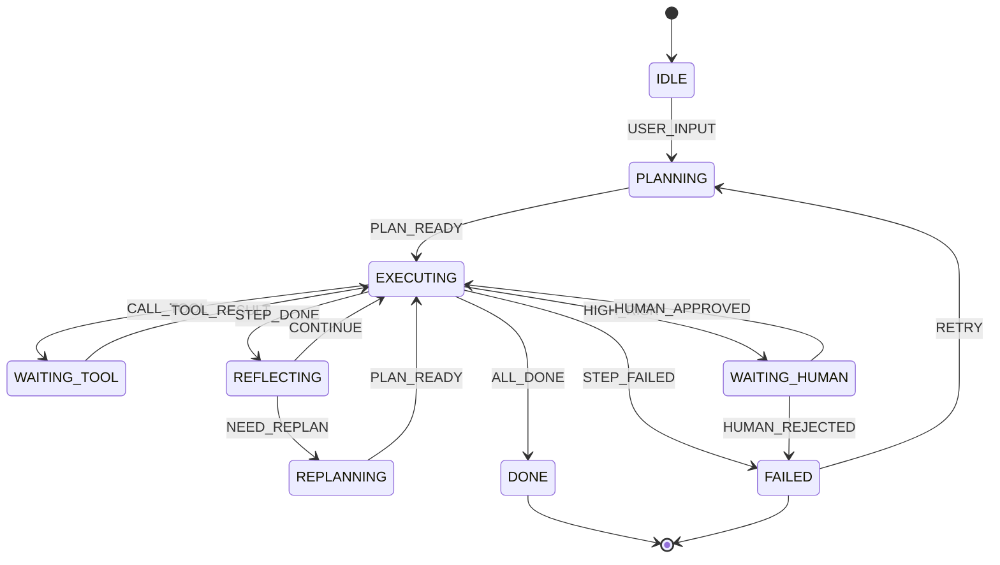

# 讲解 2.5 执行循环与状态机

> 说明：2.1 给了 Agent 全局观，2.2 讲规划，2.3 讲工具，2.4 讲记忆。  
> 2.5 讲 **Agent 的“心脏”**：执行循环怎么转、状态怎么管、中断了怎么恢复、什么时候停。  
> 更细的反思放在 2.6，单 Agent 架构放在 2.7，2.5 聚焦“循环与状态”。

---

## 1. 定位

Agent 核心层第 5 个知识点，属于“运行时核心”。  
它解决一个核心问题：**Agent 如何把规划、工具、记忆串成一个可运行、可中断、可恢复、可终止的循环？**

它是 2.6 反思、2.7 单 Agent 架构、2.8 多 Agent 协作、3.3 编排框架的直接前置。

## 2. 一句话定义

执行循环与状态机，是 Agent 在“观察 → 决策 → 行动 → 更新”的循环中推进任务，并用状态机管理流程、用检查点支持中断恢复、用终止条件防止失控的运行时机制。

简化公式：

```text
Agent 运行时 = 执行循环（Loop） + 状态管理（State） + 终止控制（Termination）
```

## 3. 为什么需要

没有执行循环与状态机，Agent 会：

- **死循环**：反复调用同一个工具，永不停止。
- **状态丢失**：多步任务中间结果丢失，重复劳动。
- **无法恢复**：任务中断后只能重来。
- **流程混乱**：不知道当前在哪一步、下一步该做什么。
- **无法终止**：目标没完成但预算已耗尽。
- **错误无法恢复**：一步失败整个任务失败。
- **无法并行**：多个可并行步骤串行执行。
- **难以调试**：不知道 Agent 为什么做了某个决策。

**类比**：

```text
没有状态机 = 一个没有流程图的工厂，工人凭感觉干活
有状态机   = 一个有明确工序、质检点、异常处理的流水线
```

## 4. 核心原理

### 4.1 执行循环的基本形态

所有 Agent 循环本质都是：

```text
while not done:
    1. 观察当前状态（Observe）
    2. 决策下一步（Decide）
    3. 执行行动（Act）
    4. 获取结果（Observe Result）
    5. 更新状态（Update）
    6. 检查终止条件（Check）
```

对应到 ReAct：

```text
Thought → Action → Observation → Thought → ... → Answer
```

对应到 Plan-Execute：

```text
Plan → Execute Step → Update → Execute Next → ... → Done
```

### 4.2 循环的三种形态

**形态 1：ReAct 循环（边想边做）**

```text
Thought → Action → Observation →（未完成）→ 回到 Thought → ... → Answer
```

特点：

- 灵活，适应性强
- 每步都调 LLM，成本高
- 容易短视
- 适合：动态环境、工具调用

**形态 2：Plan-Execute 循环（先规划再执行）**

```text
Plan（一次性规划）
  → Execute Step 1 → Update → Execute Step 2 → ...（逐步执行、逐步更新状态）
  → 计划走完 → Done
  → 执行中发现计划不可行 → 回到 Plan（重规划）
```

特点：

- 结构清晰
- 可并行
- 规划可能过时
- 适合：多步任务、已知流程

**形态 3：混合循环（生产推荐）**

```text
┌─────────────────────────────────────┐
│  粗规划（Plan）                     │
│      ↓                              │
│  执行一步                           │
│      ↓                              │
│  观察结果                           │
│      ↓                              │
│  需要调整？──是──→ 局部重规划       │
│      │                              │
│      否                             │
│      ↓                              │
│  还有步骤？──是──→ 执行下一步       │
│      │                              │
│      否                             │
│      ↓                              │
│  Done                               │
└─────────────────────────────────────┘
```

**三形态对比**：

| 维度 | ReAct | Plan-Execute | 混合 |
|---|---|---|---|
| 每步是否调 LLM 决策 | 是 | 仅规划阶段 | 执行步轻量调用 |
| 成本 | 高 | 低 | 中 |
| 灵活性 | 高 | 低（计划易过时） | 高（可局部重规划） |
| 适用场景 | 动态环境、工具调用 | 已知流程、多步任务 | 长任务生产环境 |

### 4.3 状态机（State Machine）

**什么是状态机**：

```text
状态（State） + 事件（Event） + 转移（Transition） + 动作（Action）
```

Agent 状态机示例：

```text
状态：
- IDLE          空闲
- PLANNING      规划中
- EXECUTING     执行中
- WAITING_TOOL  等待工具
- REFLECTING    反思中
- REPLANNING    重规划中
- DONE          完成
- FAILED        失败
- WAITING_HUMAN 等待人工

事件（与下方转移图一一对应）：
- USER_INPUT       用户输入
- PLAN_READY       计划就绪
- CALL_TOOL        调用工具
- TOOL_RESULT      工具返回
- STEP_DONE        步骤完成
- CONTINUE         反思通过，继续
- NEED_REPLAN      反思判定需要重规划
- ALL_DONE         全部步骤完成
- STEP_FAILED      步骤失败
- HIGH_RISK        高风险操作，需人工
- HUMAN_APPROVED   人工批准
- HUMAN_REJECTED   人工拒绝
- RETRY            失败后重试
- MAX_STEPS        达到最大步数（由 4.5 的终止检查触发）
```

状态转移图：



**为什么用状态机**：

- 流程显式，可审查
- 状态可持久化，支持恢复
- 转移条件明确，防止跑偏
- 易于测试和调试
- 支持并行和分支

### 4.4 状态管理

状态是循环的“账本”，至少要记五类信息（可运行的完整定义见 6.1 的 AgentState）：

| 类别 | 字段 | 说明 |
|---|---|---|
| 流程状态 | status / current_step / total_steps | 当前阶段、执行到第几步 |
| 任务状态 | goal / plan / step_results | 目标、计划、各步骤结果 |
| 上下文 | messages / working_memory | 对话历史与工作记忆 |
| 控制 | max_steps / budget / cost_used / retry_count | 步数、预算、重试的控制量 |
| 错误 | last_error / errors | 最后错误与错误历史 |

**状态更新原则**：

- 每次循环后更新状态
- 状态必须可序列化
- 状态变更要记录日志
- 关键状态要持久化

### 4.5 终止条件

**必须设置的终止条件**：

| 条件 | 说明 | 优先级 |
|---|---|---|
| 目标完成 | 任务成功 | 高 |
| 最大步数 | 防止死循环 | 高 |
| 超时 | 防止无限等待 | 高 |
| 预算超限 | 防止成本爆炸 | 高 |
| 连续失败 | 防止无意义重试 | 中 |
| 人工中断 | 用户主动停止 | 中 |
| 状态不变 | 检测循环 | 中 |

设计要点（完整实现见 6.1 的 should_terminate）：

- **硬熔断在前**：最大步数、超时、预算是“无论如何都会停”的兜底，放在每轮循环入口第一件事检查。
- **软检测在后**：循环检测看最近 3 步的动作指纹（工具名 + 参数哈希）是否完全相同，相同即终止。
- **终止要带回执**：返回 (是否终止, 原因) 二元组，让调用方区分“完成”与“失败”。

**面试高频问法**：“Agent 陷入死循环、工具反复失败怎么处理？”共识口径是分层防护：工具层给单个工具加重试上限与指数退避；循环层做动作指纹检测，相同动作连续 N 次即熔断并触发重规划；任务层用最大步数、预算、超时兜底；最终失败时返回部分结果与失败原因，而不是原地无限重试。

### 4.6 中断与恢复

**为什么需要中断恢复**：

- 任务执行时间长
- 需要人工审批
- 系统故障
- 用户主动暂停
- 成本超限暂停

**检查点（Checkpoint）**：在关键节点把可序列化的状态快照（状态 + 时间戳 + 检查点 ID）写入外部存储。类比：游戏的“存档点”——打 Boss 前先存档，团灭后从存档处重来，而不是回新手村从头再来。

**恢复流程**：

```text
1. 加载最近检查点
2. 恢复状态
3. 从断点继续执行（跳过 step_results 中已完成的步骤）
4. 每完成一步继续保存
```

存储实现见 6.2（FileCheckpointer），高风险操作的人工审批中断见 6.5；“跳过已完成步骤”的续行逻辑已内置在 6.1 的 AgentRuntime.run 里。

### 4.7 错误恢复

**错误分类与处理**：

| 错误 | 处理策略 |
|---|---|
| 工具超时 | 重试 + 降级 |
| 工具失败 | 重试 + 替代工具 |
| LLM 输出错误 | 重试 + 修正 Prompt |
| 参数错误 | 反馈 LLM 修正 |
| 权限错误 | 拒绝 + 告知用户 |
| 状态冲突 | 回滚 + 重规划 |

**重试策略**：

```python
async def execute_with_retry(step, max_retries: int = 3):
    for attempt in range(max_retries):
        try:
            return await execute_step(step)
        except RetryableError as e:
            if attempt == max_retries - 1:
                raise
            await asyncio.sleep(2 ** attempt)
        except NonRetryableError:
            raise
```

**降级策略**：

```python
async def execute_with_fallback(step):
    try:
        return await primary_tool(step)
    except Exception:
        try:
            return await fallback_tool(step)
        except Exception:
            return await cached_result(step)
```

### 4.8 并行执行

**可并行的条件**：

- 步骤之间无依赖
- 资源充足
- 无共享状态冲突

**DAG 并行**：

```python
async def execute_dag(plan: dict):
    results = {}
    completed = set()

    while len(completed) < len(plan["steps"]):
        ready = [
            s for s in plan["steps"]
            if s["id"] not in completed
            and all(d in completed for d in s.get("depends_on", []))
        ]

        # 并行执行所有 ready 步骤
        tasks = [execute_step(s) for s in ready]
        outputs = await asyncio.gather(*tasks, return_exceptions=True)

        for step, output in zip(ready, outputs):
            if isinstance(output, Exception):
                handle_error(step, output)
            else:
                results[step["id"]] = output
                completed.add(step["id"])

    return results
```

### 4.9 循环与状态机的工程实现

**方式 1：手写 while 循环**

```python
async def agent_loop(goal: str, max_steps: int = 10):
    state = AgentState(goal=goal, max_steps=max_steps)

    while True:
        done, reason = should_terminate(state)
        if done:
            return state, reason

        action = await decide_action(state)
        result = await execute_action(action)
        state = update_state(state, action, result)
```

优点：简单直接。  
缺点：状态管理靠手写，复杂场景难维护。

**方式 2：状态机框架**

```python
from transitions import Machine

class Agent:
    states = ["IDLE", "PLANNING", "EXECUTING", "DONE", "FAILED"]

    def __init__(self):
        self.machine = Machine(
            model=self,
            states=Agent.states,
            initial="IDLE",
            transitions=[
                {"trigger": "start", "source": "IDLE", "dest": "PLANNING"},
                {"trigger": "plan_ready", "source": "PLANNING", "dest": "EXECUTING"},
                {"trigger": "complete", "source": "EXECUTING", "dest": "DONE"},
                {"trigger": "fail", "source": "EXECUTING", "dest": "FAILED"},
            ],
        )
```

**方式 3：图编排（LangGraph）**

把状态与转移声明成图：节点是函数，边是转移，条件边实现分支与循环，编译时挂上 checkpointer 就自动获得中断恢复。完整可运行示例见 6.3。

取舍：方式 1 最直观，适合原型；方式 2 把非法转移直接挡在门外；方式 3 把状态、转移、持久化、并行全部交给框架，是生产环境主流（选型细节在 3.3 展开）。

### 4.10 循环与各组件的交互

一轮循环就是依次经过五个组件，每个组件对应知识库的一个锚点：

```text
2.2 规划 ─→ LLM 决策 ─→ 2.3 工具执行 ─→ 2.4 记忆读写
    ↑                                            ↓
    │                                        观察结果
    └── 2.6 反思 ←── 更新状态 ←─────────────────┘
                        ↓
                 终止？──是──→ 输出最终答案
                  │否
                  └──→ 回到 LLM 决策（下一轮）
```

## 5. 架构 / 流程

一个完整的执行循环与状态机：

```text
┌──────────────────────────────────────────┐
│  初始化                                   │
│  ├─ 加载目标                             │
│  ├─ 加载记忆                             │
│  ├─ 初始化状态                           │
│  └─ 创建检查点                           │
└──────────────────────────────────────────┘
                  ↓
┌──────────────────────────────────────────┐
│  主循环                                   │
│  ┌────────────────────────────────────┐  │
│  │  1. 检查终止条件                   │  │
│  │     ├─ 完成？→ 退出                │  │
│  │     ├─ 超限？→ 退出                │  │
│  │     └─ 继续                        │  │
│  │  2. 观察状态                       │  │
│  │  3. LLM 决策                       │  │
│  │  4. 选择行动                       │  │
│  │  5. 执行（可能并行）               │  │
│  │  6. 获取结果                       │  │
│  │  7. 更新状态                       │  │
│  │  8. 保存检查点                     │  │
│  │  9. 记录日志                       │  │
│  └────────────────────────────────────┘  │
└──────────────────────────────────────────┘
                  ↓
┌──────────────────────────────────────────┐
│  异常处理                                 │
│  ├─ 可重试？→ 重试                       │
│  ├─ 可降级？→ 降级                       │
│  ├─ 需重规划？→ 回规划                   │
│  └─ 不可恢复？→ 失败                     │
└──────────────────────────────────────────┘
                  ↓
┌──────────────────────────────────────────┐
│  输出                                     │
│  ├─ 最终答案                             │
│  ├─ 执行轨迹                             │
│  └─ 状态快照                             │
└──────────────────────────────────────────┘
```

## 6. 代码 / 工具

### 6.1 完整的 Agent 循环（带状态机）

```python
import asyncio
import time
import json
from enum import Enum
from dataclasses import dataclass, field, asdict

class AgentStatus(Enum):
    IDLE = "idle"
    PLANNING = "planning"
    EXECUTING = "executing"
    REFLECTING = "reflecting"
    DONE = "done"
    FAILED = "failed"

@dataclass
class AgentState:
    goal: str = ""
    status: str = AgentStatus.IDLE.value
    plan: list = field(default_factory=list)
    current_step: int = 0
    step_results: dict = field(default_factory=dict)
    messages: list = field(default_factory=list)
    cost_used: float = 0.0
    budget: float = 5.0
    max_steps: int = 20
    retry_count: int = 0
    consecutive_failures: int = 0
    last_error: str = ""
    start_time: float = field(default_factory=time.time)
    timeout: float = 300.0
    action_history: list = field(default_factory=list)

    def to_dict(self):
        return asdict(self)

    @classmethod
    def from_dict(cls, data):
        return cls(**data)

class AgentRuntime:
    def __init__(self, llm, tools, memory=None, checkpointer=None):
        self.llm = llm
        self.tools = tools
        self.memory = memory
        self.checkpointer = checkpointer

    def should_terminate(self, state: AgentState) -> tuple[bool, str]:
        # 4.5 终止条件的完整实现：硬熔断 + 软检测
        if state.status == AgentStatus.DONE.value:
            return True, "完成"
        if state.status == AgentStatus.FAILED.value:
            return True, "失败"
        if state.current_step >= state.max_steps:
            return True, "达到最大步数"
        if time.time() - state.start_time > state.timeout:
            return True, "超时"
        if state.cost_used > state.budget:
            return True, "预算超限"
        if state.consecutive_failures >= 3:
            return True, "连续失败"
        # 循环检测：最近 3 步动作指纹完全相同
        recent = state.action_history[-3:]
        if len(recent) == 3 and len(set(recent)) == 1:
            return True, "检测到循环"
        return False, ""

    async def run(self, goal: str) -> AgentState:
        state = AgentState(goal=goal)

        while True:
            done, reason = self.should_terminate(state)
            if done:
                state.status = AgentStatus.DONE.value if reason == "完成" else AgentStatus.FAILED.value
                state.last_error = reason if reason != "完成" else ""
                break

            try:
                # 1. 规划（如果还没有）
                if not state.plan:
                    state.status = AgentStatus.PLANNING.value
                    state.plan = await self._plan(state)
                    if self.checkpointer:
                        self.checkpointer.save(state)

                # 2. 执行当前步骤
                state.status = AgentStatus.EXECUTING.value
                step = state.plan[state.current_step]

                if step["id"] in state.step_results:
                    state.current_step += 1
                    continue

                result = await self._execute_step(step, state)
                state.step_results[step["id"]] = result
                state.action_history.append(step.get("action", ""))
                state.current_step += 1
                state.consecutive_failures = 0

                # 3. 保存检查点
                if self.checkpointer:
                    self.checkpointer.save(state)

                # 4. 判断是否完成
                if state.current_step >= len(state.plan):
                    state.status = AgentStatus.DONE.value
                    break

            except Exception as e:
                state.last_error = str(e)
                state.consecutive_failures += 1
                state.retry_count += 1
                if state.consecutive_failures >= 3:
                    state.status = AgentStatus.FAILED.value
                    break
                # 重试
                await asyncio.sleep(2 ** state.retry_count)

        return state

    async def _plan(self, state: AgentState) -> list:
        # 调用 LLM 生成计划
        prompt = f"把目标分解为步骤，输出 JSON：{{'steps': [...]}}\n目标：{state.goal}"
        response = await self.llm.chat([{"role": "user", "content": prompt}], temperature=0)
        data = json.loads(response)
        return data["steps"]

    async def _execute_step(self, step: dict, state: AgentState):
        tool_name = step.get("tool")
        if tool_name and tool_name in self.tools:
            return await self.tools[tool_name](**step.get("args", {}))
        return {"result": "no tool"}
```

### 6.2 带检查点的循环

```python
import json
from pathlib import Path

class FileCheckpointer:
    def __init__(self, path: str):
        self.path = Path(path)
        self.path.mkdir(parents=True, exist_ok=True)

    def save(self, state: AgentState):
        checkpoint_file = self.path / f"{state.goal[:20]}.json"
        checkpoint_file.write_text(
            json.dumps(state.to_dict(), ensure_ascii=False, indent=2),
            encoding="utf-8",
        )

    def load(self, name: str) -> AgentState:
        checkpoint_file = self.path / f"{name}.json"
        data = json.loads(checkpoint_file.read_text(encoding="utf-8"))
        return AgentState.from_dict(data)

# 使用
checkpointer = FileCheckpointer("./checkpoints")
runtime = AgentRuntime(llm, tools, checkpointer=checkpointer)
state = await runtime.run("分析销售数据")
```

### 6.3 LangGraph 状态机

```python
from langgraph.graph import StateGraph, START, END
from langgraph.checkpoint.sqlite import SqliteSaver  # 需单独安装 langgraph-checkpoint-sqlite
from typing import TypedDict, Annotated
import operator

class State(TypedDict):
    messages: Annotated[list, operator.add]
    plan: list
    current_step: int
    results: dict
    error: str

def planner(state: State):
    plan = generate_plan(state["messages"][-1])
    return {"plan": plan, "current_step": 0, "results": {}}

def executor(state: State):
    if state["current_step"] >= len(state["plan"]):
        return {"error": ""}
    step = state["plan"][state["current_step"]]
    try:
        result = execute_step(step)
        return {
            "results": {**state["results"], step["id"]: result},
            "current_step": state["current_step"] + 1,
        }
    except Exception as e:
        return {"error": str(e)}

def should_continue(state: State) -> str:
    if state.get("error"):
        return "replan"
    if state["current_step"] >= len(state["plan"]):
        return "end"
    return "execute"

def replan(state: State):
    new_plan = generate_plan(state["messages"][-1], error=state["error"])
    return {"plan": new_plan, "current_step": 0, "error": ""}

graph = StateGraph(State)
graph.add_node("planner", planner)
graph.add_node("executor", executor)
graph.add_node("replan", replan)

# 截至 2026 年的推荐写法：START 显式连边（set_entry_point 已废弃）
graph.add_edge(START, "planner")
graph.add_edge("planner", "executor")
graph.add_conditional_edges("executor", should_continue, {
    "execute": "executor",
    "replan": "replan",
    "end": END,
})
graph.add_edge("replan", "executor")

# 带持久化：from_conn_string 返回上下文管理器，必须用 with（截至 2026 年）
with SqliteSaver.from_conn_string("checkpoints.db") as memory:
    app = graph.compile(checkpointer=memory)
    # 同一 thread_id 再次 invoke，即从最近检查点恢复（中断恢复）
    config = {"configurable": {"thread_id": "task-123"}}
    result = app.invoke({"messages": ["分析销售数据"]}, config)
```

### 6.4 并行执行

```python
async def execute_parallel_steps(steps: list, tool_map: dict):
    async def run_one(step):
        tool = tool_map.get(step["tool"])
        if not tool:
            return {"error": f"工具 {step['tool']} 不存在"}
        try:
            return await tool(**step.get("args", {}))
        except Exception as e:
            return {"error": str(e)}

    tasks = [run_one(s) for s in steps]
    results = await asyncio.gather(*tasks, return_exceptions=True)
    return list(zip([s["id"] for s in steps], results))
```

### 6.5 中断与人工审批

```python
class HumanApprovalRequired(Exception):
    def __init__(self, step, state):
        self.step = step
        self.state = state

async def execute_with_approval(step, state, checkpointer):
    if step.get("risk") == "high":
        # 保存检查点，抛出中断
        checkpointer.save(state)
        raise HumanApprovalRequired(step, state)
    return await execute_step(step)

# 恢复
async def resume_with_approval(state: AgentState, approved: bool):
    if not approved:
        state.status = AgentStatus.FAILED.value
        state.last_error = "人工拒绝"
        return state
    # run_from_state：与 6.1 的 run 相同，只是以传入的 state 为起点
    return await runtime.run_from_state(state)
```

## 7. 案例

### 案例 A：多步数据分析的循环

**目标**：“分析销售下降原因。”

**执行轨迹**：

```text
Step 1: 加载数据 → 成功
Step 2: 按月聚合 → 成功，发现 3 月下降
Step 3: 按地区聚合 → 成功，发现华东下降
Step 4: 按产品聚合 → 失败（产品字段不存在）
  → 重试一次 → 仍失败
  → 反思：字段名可能是 product_name
  → 重新执行 → 成功
Step 5: 生成报告 → 成功
状态：DONE
```

**关键**：失败后不是直接终止，而是反思、调整、重试。

### 案例 B：中断恢复

**场景**：任务执行到 Step 3，用户要求暂停。

**处理**：

1. 保存检查点（状态、计划、已完成步骤）。
2. 任务暂停。
3. 用户稍后恢复。
4. 加载检查点，从 Step 3 继续。
5. 跳过已完成的 Step 1、2。

**价值**：长任务不丢失进度。

### 案例 C：死循环检测

**问题**：Agent 反复调用 `search` 工具，参数相同。

**检测**：取最近 3 步的动作指纹（工具名 + 参数哈希），完全相同即判定为循环——实现见 6.1 should_terminate 的循环检测分支。

**处理**：

1. 终止循环。
2. 记录错误。
3. 返回部分结果 + 错误说明。
4. 可选：触发重规划。

## 8. 常见坑

1. **没有最大步数限制**。  
   Agent 可能无限循环，必须设上限。

2. **没有超时控制**。  
   工具卡住，整个任务挂起。

3. **没有预算限制**。  
   多步调用 token 爆炸，成本失控。

4. **状态不持久化**。  
   中断后无法恢复，必须重来。

5. **检查点太频繁**。  
   每步都存大状态，IO 成为瓶颈。按需保存。

6. **状态太大**。  
   把整个上下文都存进状态，序列化慢。只存必要信息。

7. **不检测循环**。  
   相同动作重复执行，浪费成本。

8. **错误处理太粗**。  
   `except Exception: pass` 吞掉错误，无法恢复。

9. **重试无上限**。  
   一直重试失败的操作，永不终止。

10. **不做降级**。  
    主工具挂了就失败，没有备用方案。

11. **并行不考虑依赖**。  
    有依赖的步骤并行执行，结果错误。

12. **状态机太复杂**。  
    状态和转移太多，难以维护。保持简单。

13. **忽略人工介入点**。  
    高风险操作应暂停等待审批。

14. **不做执行轨迹记录**。  
    出问题无法调试，不知道哪步错了。

15. **状态更新不是原子的**。  
    并发更新状态导致数据竞争。

## 9. 练习

1. 实现一个带最大步数、超时、预算限制的 Agent 循环。
2. 实现状态机，包含 IDLE、PLANNING、EXECUTING、DONE、FAILED。
3. 实现检查点保存与恢复，模拟中断后继续。
4. 实现循环检测：最近 3 步相同则终止。
5. 实现并行执行 DAG 中的无依赖步骤。
6. 实现错误重试 + 降级策略。
7. 实现人工审批中断：高风险操作暂停。
8. 用 LangGraph 重构你的 Agent 循环。
9. 记录执行轨迹，输出每步的 thought、action、observation。
10. 对比 ReAct 循环和 Plan-Execute 循环在同一任务上的成本、延迟、成功率。

## 10. 小结

- 执行循环 = **观察 → 决策 → 行动 → 更新 → 检查**。
- 三种形态：**ReAct、Plan-Execute、混合**。
- 状态机 = **状态 + 事件 + 转移 + 动作**。
- 终止条件：**完成、最大步数、超时、预算、连续失败、循环检测**。
- 中断恢复：**检查点 + 状态持久化 + 断点续行**。
- 错误恢复：**重试 + 降级 + 重规划**。
- 并行执行：**DAG + asyncio.gather**。
- 工程实现：**手写循环 → 状态机框架 → 图编排（LangGraph）**。
- 核心原则：**显式状态、明确终止、可恢复、可观测。**
- 这些能力直接支撑：2.6 反思、2.7 单 Agent 架构、2.8 多 Agent、3.3 编排框架。
