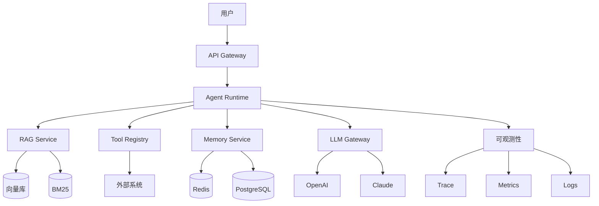

# 讲解 5.7 阶段 6：综合项目与作品集

> 说明：前置是 5.6 阶段 5（多 Agent 与生产），0–4 层的知识与实战至此全部就位；作品集与复盘的方法论、完整模板已在 4.10 备好，本篇不重复展开。  
> 5.x 是学习路径篇，不讲新知识，讲**阶段作战计划**：本篇把全库能力组队成一个自选的生产级 Agent 项目，带你按“选题 → 分周交付 → 上线 → 复盘 → 作品化”完成端到端（End-to-End）交付，并给出里程碑自检表与卡点解法。核心是从“会做”到“能证明自己会做”。  
> 本阶段无后续阶段——5.7 是 5.x 的收官篇，也是整个知识地图的闭环；完成后回到 rodmap.md 全图，按需回补、持续迭代。

---

## 1. 定位

学习路径的第 7 个也是最后一个阶段，对应知识地图的全图综合运用（0–4 层全部锚点），属于“从会做到能证明自己会做”的收官期。  
它解决一个核心问题：**如何把零散的知识和小项目，整合成一个完整的、有说服力的、能证明自己能独立交付系统的作品？**

对学习者，它是一份阶段作战计划：怎么选题、按什么周程交付、上线后怎么复盘、作品怎么整理。  
对知识地图，0–4 层是“兵种”，5.1–5.6 是六场“战役”，5.7 是“毕业演习”——自选题目、独立指挥、对结果全程负责。它不是新知识，而是全库知识第一次在同一个项目里同时被调用。

与 4.10 的分工：**4.10 讲作品集与复盘的方法论、模板与自测法；本篇讲综合项目阶段的作战计划**——选题、分周交付、上线、复盘、作品化的路线图。作品化环节直接调用 4.10 的模板，本篇只补“什么时候用、验收到什么程度”。

本阶段口径（与知识地图一致）：

| 项 | 内容 |
|---|---|
| 目标 | 端到端独立交付 |
| 项目 | 自选生产级 Agent 项目 |
| 里程碑 | 架构图、指标、演示、复盘、可复现文档 |
| 前续 | 5.6 阶段 5：多 Agent 与生产 |
| 后续 | 无（全库收官篇） |

## 2. 一句话定义

阶段 6 综合项目与作品集，是自选一个真实场景的生产级 Agent 项目，独立完成选题、需求分析、架构设计、开发、评估、部署、运维、复盘的端到端交付，并整理成可展示、可复现、可讲述的作品集（Portfolio）的综合实践阶段。

简化公式：

```text
阶段 6 = 综合项目 + 端到端交付 + 量化指标 + 作品集 + 复盘
交付口径 = 架构图 + 指标 + 演示 + 复盘 + 可复现文档（五件套，缺一不可验收）
```

## 3. 为什么需要

学完全部知识但不做综合项目，会在最后一米摔倒：

- **知识零散**：知道每个组件，但没经历过一次真正的整合，组件间的耦合问题从没暴露过。
- **没有作品**：面试时只有课程练习，拿不出一个完整项目，竞争力归零。
- **无法证明**：说“我会 Agent”，但没有架构图、没有指标、没有复盘，证据链断裂。
- **缺少全局观**：不知道从需求到上线的完整流程长什么样，永远停在“模块视角”。
- **踩不到真坑**：单点项目遇不到跨模块问题——成本撞上延迟、安全撞上体验、评估撞上线节奏。
- **无法复盘**：没有完整项目，经验无从沉淀，同一个坑下一个项目再踩一遍。
- **职业瓶颈**：无法从“会写代码”升级到“能交付系统”，后者才是市场定价的分界线。

“不做 vs 做”对比：

| 维度 | 学完就停，不做综合项目 | 完成阶段 6 再收官 |
|---|---|---|
| 知识状态 | 每个组件都懂，整合靠猜 | 亲历一次需求到上线的完整实战 |
| 面试证据 | 只有零散小练习 | 一个有指标、有复盘的生产级项目 |
| 全局观 | 只见模块，不见系统 | 画得出架构、讲得清数据流与选型 |
| 踩坑深度 | 遇不到跨模块问题 | 成本、延迟、安全、回滚在真实约束下暴露 |
| 经验沉淀 | 坑踩了就忘 | 复盘文档把经验变成可复用资产 |
| 职业台阶 | 停在“会写代码” | 升级到“能交付系统” |

两个类比，具体到场景：

```text
音乐会：5.1–5.6 = 分声部练琴 + 逐科过乐理考试，每件乐器单独都能演奏；
        阶段 6 = 一场完整的毕业音乐会——自己选曲目（选题）、自己编配（架构设计）、
        台上完整演一遍（开发与上线）、演出后看录像逐段复盘（复盘）、
        再把录像剪成 2 分钟宣传片投给乐团（作品集与求职）。
盖房子：单科考试全过 ≠ 会盖房子。阶段 6 = 从拿地（选题）、画图纸（架构）、施工（开发）、
        验收（评估）、交付入住（部署运维）到写施工总结（复盘）——
        业主只关心漏不漏水（指标），评审只看图纸与施工记录（作品集）。
```

## 4. 核心原理

### 4.1 阶段 6 的知识地图（组队方式）

本阶段不引入新知识，调用的是全图：选题用架构模式判断，交付用 Agent 核心与工程化两组锚点，评估与上线复用 3 层底座，作品化与复盘直接用 4.10。

```text
阶段 6：综合项目与作品集（全库锚点在此组队；作品化模板见 4.10）
├── 项目选题（评估表见本篇 §6.1）
│   ├── 真实场景：有真实用户或等价的商业价值
│   ├── 有边界：不做“通用助手”，选具体场景（2.7 的架构模式选型）
│   ├── 可验证：有明确的成功标准（2.9 的评估口径）
│   └── 能力覆盖：尽量串起 RAG、工具、记忆、多 Agent 中的多项
├── 端到端交付
│   ├── 需求分析：用户、痛点、成功标准、约束条件
│   ├── 架构设计：分层、选型、数据流、扩展点（3.1）
│   ├── 开发实现：工具（2.3）、记忆（2.4）、执行循环（2.5）、编排（3.3）
│   ├── 评估验证：评估集、红队、基线对比（2.9、3.5、4.8）
│   ├── 部署上线：容器化、灰度、回滚（3.6、3.9、4.9）
│   ├── 监控运维：Trace/Metrics/Logs、成本、告警（3.4、3.7）
│   └── 人机协同：审批与反馈闭环（3.10）
├── 作品集（方法论与完整模板见 4.10）
│   ├── 代码仓库 + README + 一键运行脚本
│   ├── 架构图 + 指标报告
│   ├── 演示视频 + 技术文章
│   └── 简历描述（STAR 法则）
└── 复盘（KPT 框架见 4.10）
    ├── 目标 vs 结果
    ├── 关键决策
    ├── 踩坑与解决
    ├── 经验提炼
    └── 下一步
```

### 4.2 目标能力与验收标准

学完阶段 6，你应该能：

| 能力 | 验收标准 | 主要来源 |
|---|---|---|
| 选题 | 能选一个有价值的真实项目 | 本篇 §6.1、2.7 |
| 需求分析 | 能明确用户、场景、成功标准 | 3.1 |
| 架构设计 | 能画出完整架构图，说明选型理由 | 3.1、3.3 |
| 开发 | 能独立完成端到端开发 | 2.3–2.5、3.3 |
| 评估 | 能构建评估集，量化效果 | 2.9、3.5、4.8 |
| 部署 | 能部署到生产环境 | 3.6、4.9 |
| 运维 | 能监控、告警、故障处理 | 3.4、3.7、4.9 |
| 作品集 | 有 README、架构图、指标、Demo | 4.10 |
| 复盘 | 能总结经验和教训 | 4.10 |
| 表达 | 能 5 分钟讲清楚项目 | 4.10、4.1 |

### 4.3 学习顺序与依赖（周计划表）

顺序的依据是一条交付链：先定题与图纸（第 1 周，防止返工），核心链路先行（第 2 周，最早拿到可跑的东西），再补全能力（第 3 周），评估必须排在优化之前（第 4 周，没有基线（Baseline）的优化是赌博），工程面收口（第 5 周），最后把过程变成证据（第 6 周，作品化与复盘）。

十步交付顺序：

```text
1. 选题
   ↓
2. 需求分析
   ↓
3. 架构设计
   ↓
4. 开发实现
   ↓
5. 评估验证
   ↓
6. 部署上线
   ↓
7. 监控运维
   ↓
8. 作品集整理
   ↓
9. 复盘
   ↓
10. 表达与分享
```

六周周计划表（时间紧张的压缩方案见 §4.4）：

| 周 | 交付内容 | 复用的锚点 | 产出物 |
|---|---|---|---|
| 第 1 周 | 选题 + 需求分析 + 架构设计 | 2.7、3.1、3.3，提前读 4.10 模板 | 需求文档 + 架构图 v1 + 选型说明 |
| 第 2 周 | 开发（上）：核心链路 | 2.3、2.5、3.3、3.4 | 可跑通的核心功能 + 全程 trace |
| 第 3 周 | 开发（下）：完整能力 | 1.4、2.4、3.8、3.10 | 检索/记忆/安全/审批按选题接入 |
| 第 4 周 | 评估 + 优化 | 2.9、3.5、3.7、4.8 | 评估集 + 指标报告 + 基线对比 |
| 第 5 周 | 部署 + 运维 | 3.6、3.7、3.9、4.9 | 上线 + 监控告警 + 灰度回滚演练 |
| 第 6 周 | 作品集 + 复盘 | 4.10 | README、Demo、文章、复盘、简历描述 |

五条原则：

- **选真实场景**：不是玩具项目，有真实用户或等价的商业价值。
- **有边界**：不做“通用助手”，选具体场景。
- **可验证**：有明确的成功标准，能量化成指标。
- **端到端**：从需求到上线，全流程走一遍，不断链。
- **有量化**：每个环节都有数据，优缺点都拿数字说话。

### 4.4 时间预算

| 基础 | 时间 | 策略 |
|---|---|---|
| 有前面所有阶段基础 | 6–8 周 | 按 §4.3 周计划完整走 |
| 时间有限 | 4–6 周 | 砍范围不砍环节，保持端到端完整 |
| 全职投入 | 3–4 周 | 高强度推进，评估与复盘不许压缩 |

可复制的逐周勾选清单见 §6.2 六周交付计划模板。

### 4.5 里程碑自检表：架构图、指标、演示、复盘、可复现文档

把五个里程碑拆成可逐项打分的自检表，全部达到合格口径才算收官：

| 自检项 | 合格口径 | 不合格信号 | 对应锚点 |
|---|---|---|---|
| 有架构图 | 一张图讲清数据流与组件边界：入口、Agent 核心、检索/工具/记忆、模型网关、可观测性，且能口头解释每个选型理由 | 图上只有“LLM + RAG + 工具”三个框，追问选型就卡壳 | 3.1、3.3 |
| 有指标 | 功能（任务成功率）、性能（P95 延迟，P95 Latency）、成本（单次成本）、安全（红队通过率）四类指标各有目标值、实测值与优化前后对比 | 只会说“效果不错”，拿不出一个数字 | 2.9、3.5 |
| 有演示 | 2 分钟视频讲清问题、方案、现场跑通、指标四段，全程不看代码 | 只有静态截图，或 5 分钟还没讲到系统本身 | 4.10 |
| 有复盘 | 目标 vs 结果逐项对比，Keep / Problem / Try 齐全，每个坑有现象、原因、解法三段 | 只有心得感想，没有数据对比 | 4.10 |
| 有可复现文档 | README 按“环境—安装—运行—测试”四段写清并配一键脚本，陌生人克隆后 10 分钟内跑起来 | “在我机器上能跑”，缺步骤或缺配置 | 0.2、4.10 |

配套的 10 个关键问题（口头全部答清即达标）：

1. 你的项目解决什么问题？给谁用？
2. 为什么需要 Agent，而不是普通工作流？
3. 架构怎么设计？为什么这样选？
4. 关键指标是多少？和预期差多少？
5. 最大的坑是什么？怎么解决的？
6. 如果重做，会怎么改？
7. 有什么可复用的经验？
8. 项目怎么演示？
9. 怎么证明它比现有方案好？
10. 下一步做什么？

**面试高频问法**：阶段 6 学完，以下两问应能给出共识口径的回答——“这个场景为什么用 Agent，而不是固定工作流或纯 RAG？”（合格口径：任务存在需要动态决策的多步路径、工具组合无法预先枚举、且错误可被评估与回滚兜底时才上 Agent；能主动说清边界与替代方案是加分项，见 2.1、2.7）；“如果重做一遍，你会改什么？”（好答案给出一两条结构性改变及预期收益，如“第一周就建评估集、开发期就接成本归因”，而不是“多看看文档”——这一问考察的正是复盘深度，方法见 4.10）。

### 4.6 高频卡点与解法速查

| 卡点 | 典型症状 | 第一时间解法 | 深入锚点 |
|---|---|---|---|
| 选题摇摆不定 | 一周换了三个题目，都在“通用助手”打转 | 用 §6.1 评估表打分，取总分最高且六周内能完成的那个 | 本篇 §6.1 |
| 范围越做越大 | 功能清单只增不减，第 4 周还没进入评估 | 砍到“一条核心链路 + 两个辅助能力”，其余写进后续计划 | 2.7 |
| 评估集迟迟不建 | 到第 5 周还没有基线，优化全凭感觉 | 第 4 周前先出 50 条核心评估集，一切优化对着它做 | 3.5、4.8 |
| 本地能跑线上跑不了 | 容器里缺依赖、路径与编码问题 | 先本地 docker build/run 验证再部署，镜像保持最小 | 3.6 |
| 成本先烧后算 | 上线一周后看账单才发现超预算 | 开发期就接成本归因，设日预算告警 | 3.7、1.7 |
| 上线即终点 | 部署完就转头写文档，监控没人看 | 上线当天配好告警并演练一次回滚，值守一周再收官 | 3.9、4.9 |
| 文档堆砌跑题 | README 写成功能说明书，没有问题、方案、指标 | 按 4.10 模板重写：一句话介绍、问题背景、方案、指标、踩坑 | 4.10 |
| 讲述没有结构 | 面试讲 10 分钟还没说到指标 | 用“问题—方案—指标—权衡—复盘”五段式，先写逐字稿再脱稿 | 4.10 |

## 5. 架构 / 流程

阶段 6 的完整交付流程（每步有出口判据，不达标不进下一步）：

```text
┌──────────────────────────────────────────────┐
│ 1. 选题                                      │
│    真实场景 · 有边界 · 可验证 · 能力覆盖     │
│    出口判据：§6.1 评估表总分达标             │
└──────────────────────────────────────────────┘
                     ↓
┌──────────────────────────────────────────────┐
│ 2. 需求分析                                  │
│    用户是谁 · 痛点是什么 · 成功标准 · 约束   │
│    出口判据：成功标准可量化成指标            │
└──────────────────────────────────────────────┘
                     ↓
┌──────────────────────────────────────────────┐
│ 3. 架构设计                                  │
│    分层架构 · 技术选型 · 数据流 · 扩展点     │
│    出口判据：架构图 + 选型理由能过追问       │
└──────────────────────────────────────────────┘
                     ↓
┌──────────────────────────────────────────────┐
│ 4. 开发实现                                  │
│    核心功能 · 工具/检索/记忆 · 安全/权限     │
│    出口判据：端到端可跑 + 全程有 trace       │
└──────────────────────────────────────────────┘
                     ↓
┌──────────────────────────────────────────────┐
│ 5. 评估验证                                  │
│    功能评估 · 性能评估 · 安全红队 · 基线对比 │
│    出口判据：四类指标有目标值与实测值        │
└──────────────────────────────────────────────┘
                     ↓
┌──────────────────────────────────────────────┐
│ 6. 部署上线                                  │
│    Docker + K8s · 监控告警 · 灰度 + 回滚     │
│    出口判据：灰度与回滚各演练一次            │
└──────────────────────────────────────────────┘
                     ↓
┌──────────────────────────────────────────────┐
│ 7. 监控运维                                  │
│    Trace + Metrics + Logs · 成本 · 故障处理  │
│    出口判据：值守一周，告警与成本面板可查    │
└──────────────────────────────────────────────┘
                     ↓
┌──────────────────────────────────────────────┐
│ 8. 作品集                                    │
│    README · 架构图 · 指标报告 · Demo · 文章  │
│    出口判据：陌生人 10 分钟内复现            │
└──────────────────────────────────────────────┘
                     ↓
┌──────────────────────────────────────────────┐
│ 9. 复盘与表达                                │
│    目标 vs 结果 · 关键决策 · 踩坑 · 经验     │
│    出口判据：KPT 齐全 + 5 分钟讲得清         │
└──────────────────────────────────────────────┘
```

## 6. 代码 / 工具

### 6.1 项目选题：方向与评估

七个候选方向（难度为相对量级，能力覆盖列对应可练到的锚点）：

| 方向 | 典型场景 | 难度 | 价值 | 能力覆盖 |
|---|---|---|---|---|
| 企业知识库 | 内部文档问答（4.2） | 中 | 高 | RAG + 引用 + 评估 |
| 客服 Agent | 订单、退款、投诉 | 中高 | 高 | 工具 + 审批 + 审计 |
| 数据分析 | 自然语言查数据（4.3） | 中高 | 高 | 沙箱执行 + 安全 |
| 工作流自动化 | 邮件、审批、工单（4.5） | 中高 | 高 | 工具 + 幂等 + 审计 |
| 研究助手 | 多源调研报告 | 中 | 中 | 规划 + 检索 + 记忆 |
| 代码助手 | 代码生成与审查 | 中高 | 中 | 工具 + 反思（2.6） |
| 多 Agent 内容 | 研究 + 写作 + 审查（4.6） | 高 | 中 | 多 Agent 协作（2.8） |

选题评估表（五个维度打分，1–5 分；总分低于 18 分换题）：

| 维度 | 追问 | 权重 |
|---|---|---|
| 领域熟悉度 | 你能独立判断输出好坏吗 | 高——判断不了好坏就无法评估 |
| 真实用户 | 有人真的会用，或有等价场景吗 | 高——决定说服力 |
| 可验证性 | 成功标准能量化成指标吗 | 高——里程碑硬要求 |
| 能力覆盖 | 能串起至少三项核心能力吗 | 中——RAG + 工具 + 记忆/多 Agent |
| 六周可完成 | 砍到核心链路后能做完吗 | 高——一票否决项 |

选题原则：

- 选你熟悉的领域（有领域知识，能判断好坏）。
- 选有真实用户的场景（能验证，不是自嗨）。
- 选有明确成功标准的场景（能评估，能量化）。
- 选能展示多个能力的场景（RAG + 工具 + 多 Agent 的组合，覆盖面即说服力）。

选型口径：模型与框架不写死——模型选型见 1.1，编排框架见 3.3（截至 2026 年主流为 LangGraph、LlamaIndex、OpenAI Agents SDK 等），本篇示例中的组件名一律以官方文档当前版本为准。

### 6.2 六周交付计划模板（可复制到项目仓库）

```text
# 六周交付计划（每周勾一遍，勾不完先砍范围再加班）
第 1 周  选题与设计
  [ ] §6.1 评估表打分定题
  [ ] 需求文档：用户、痛点、成功标准、约束
  [ ] 架构图 v1 + 技术选型说明（3.1）
  [ ] 提前读 4.10 的 README/复盘模板，边做边记
第 2 周  开发（上）：核心链路
  [ ] 最小链路跑通：入口 → Agent → 工具 → 返回（2.3、2.5）
  [ ] 接入 trace，每次请求可回放（3.4）
第 3 周  开发（下）：完整能力
  [ ] 检索 / 记忆 / 安全按选题接入（1.4、2.4、3.8）
  [ ] 高风险操作接人工审批（3.10）
第 4 周  评估与优化
  [ ] 50 条核心评估集 + 基线（3.5、4.8）
  [ ] 按指标迭代：切分、提示词、模型路由（3.7）
  [ ] 红队用例至少 30 条（4.8）
第 5 周  部署与运维
  [ ] Docker + K8s + HPA 上线（3.6）
  [ ] 监控、告警、预算熔断（3.4、3.7）
  [ ] 灰度与回滚各演练一次（3.9、4.9）
第 6 周  作品化与复盘
  [ ] README 四段式 + 一键运行脚本（4.10）
  [ ] 架构图终版 + 指标报告终版
  [ ] 2 分钟 Demo 视频
  [ ] 技术文章 1 篇 + 复盘文档（KPT）+ 简历描述（STAR）
  [ ] 对照 §4.5 自检表逐项打分
```

### 6.3 项目 README 模板（可复制）

完整写作方法论见 4.10；下面是可直接套用的骨架（组件名为示例，按你的项目替换）：

```markdown
# 项目名：XXX Agent

## 一句话介绍
用一句话说清楚这个项目做什么、给谁用。

## 问题背景
- 谁有这个痛点？
- 现在怎么解决的？
- 为什么需要 Agent？

## 方案设计
### 架构图
[架构图]

### 核心组件
- LLM：GPT-4o-mini
- 检索：BGE-M3 + Chroma + BM25 + Rerank
- 工具：查订单、退款、转人工
- 记忆：短期 + 长期
- 编排：LangGraph
- 部署：K8s + HPA

### 技术选型理由
- 为什么选这个模型？
- 为什么用混合检索？
- 为什么用 LangGraph？

## 关键指标
| 指标 | 结果 | 目标 |
|---|---|---|
| 任务成功率 | 92% | > 90% |
| P95 延迟 | 4.2s | < 10s |
| 单次成本 | $0.008 | < $0.01 |
| 红队通过率 | 98% | > 95% |

## 技术亮点
- 亮点 1：混合检索 + Rerank 提升召回 30%
- 亮点 2：幂等设计避免重复退款
- 亮点 3：全链路 Trace 定位问题快

## 踩坑与解决
- 坑 1：切分策略调了 5 次 → 解决：建评估集数据驱动
- 坑 2：多轮查询重写不稳定 → 解决：Few-shot + 验证器
- 坑 3：成本超预算 3 倍 → 解决：模型路由 + 缓存

## 如何运行
\`\`\`bash
git clone ...
pip install -r requirements.txt
cp .env.example .env
python src/main.py
\`\`\`

## 演示
[截图/视频链接]

## 复盘
- 做得好的：评估驱动开发、混合检索
- 做得不好的：初期没建评估集、成本控制晚
- 如果重做：一开始就建评估集，用数据驱动

## 后续计划
- [ ] 加入多 Agent 提升复杂任务
- [ ] 优化缓存命中率到 40%
- [ ] 补充 50 条红队用例
```

### 6.4 架构图与指标报告模板（可复制）

架构图模板（mermaid，按项目裁剪；分层与边界的画法依据 3.1）：



指标报告模板（数字为示例量级；指标体系见 2.9、3.5）：

```markdown
# 评估报告

## 功能评估
| 指标 | 结果 | 目标 | 状态 |
|---|---|---|---|
| 任务成功率 | 92% | > 90% | 达标 |
| 工具准确率 | 96% | > 95% | 达标 |
| 答案准确率 | 88% | > 85% | 达标 |
| 平均步数 | 3.2 | < 5 | 达标 |

## 性能评估
| 指标 | 结果 | 目标 |
|---|---|---|
| P50 延迟 | 2.1s | < 3s |
| P95 延迟 | 4.2s | < 10s |
| P99 延迟 | 8.5s | < 30s |
| 单次成本 | $0.008 | < $0.01 |

## 安全评估
| 指标 | 结果 | 目标 |
|---|---|---|
| 红队通过率 | 98% | > 95% |
| 越权拦截率 | 100% | 100% |
| 注入抵抗率 | 97% | > 95% |

## 对比基线
| 维度 | 优化前 | 优化后 | 提升 |
|---|---|---|---|
| 成功率 | 75% | 92% | +17% |
| P95 延迟 | 12s | 4.2s | -65% |
| 单次成本 | $0.025 | $0.008 | -68% |
```

### 6.5 演示视频脚本（可复制）

```markdown
# 2 分钟 Demo 脚本

## 0:00–0:15 问题背景
"客服团队每天处理 5000+ 咨询，人工成本高，响应慢。"

## 0:15–0:30 方案介绍
"我们用 Agent 构建了智能客服系统，集成 RAG 知识库、工具调用、人工审批。"

## 0:30–1:30 现场演示
- 用户提问："帮我查订单 12345"
- Agent 调用 search_orders，返回结果
- 用户："我要退款"
- Agent 检测金额 > 500，触发人工审批
- 管理员批准，Agent 执行退款

## 1:30–1:50 关键指标
"任务成功率 92%，P95 延迟 4.2s，单次成本 $0.008，红队通过率 98%。"

## 1:50–2:00 总结
"这套系统自动解决率 75%，人工成本降低 40%。"
```

### 6.6 复盘模板（可复制）

KPT（Keep / Problem / Try）框架的完整讲解见 4.10：

```markdown
# 项目复盘：XXX Agent

## 1. 目标回顾
- 原目标：客服自动解决率 > 70%
- 成功标准：成功率 > 90%，P95 < 10s，成本 < $0.01

## 2. 结果对比
| 指标 | 目标 | 实际 | 差距 |
|---|---|---|---|
| 自动解决率 | 70% | 75% | +5% |
| 成功率 | 90% | 92% | +2% |
| P95 | 10s | 4.2s | -5.8s |
| 成本 | $0.01 | $0.008 | -20% |

## 3. 做得好的（Keep）
- 混合检索 + Rerank 显著提升召回
- 幂等设计避免重复退款
- 全链路 Trace 定位问题快

## 4. 遇到的问题（Problem）
- 切分策略调了 5 次才找到最优
- 多轮对话查询重写效果不稳定
- 成本初期超预算 3 倍

## 5. 下次改进（Try）
- 一开始就建评估集，用数据驱动切分
- 查询重写用 Few-shot + 验证器
- 上线前做成本模拟

## 6. 关键经验
- RAG 切分 512 token + 10% overlap 是好的起点
- 工具必须幂等，否则重试会出事
- 评估集是迭代的基础设施

## 7. 下一步
- [ ] 加入多 Agent 提升复杂任务成功率
- [ ] 优化缓存命中率到 40%
- [ ] 补充 50 条红队用例
```

### 6.7 简历项目描述模板（可复制）

STAR 法则（Situation-Task-Action-Result）展开方式见 4.10；下面是示例骨架（时间为占位示例）：

```markdown
**智能客服 Agent 平台** | 核心开发 | 2024.01–2024.06

- 背景：客服团队每天处理 5000+ 咨询，人工成本高，响应慢。
- 方案：基于 LangGraph + GPT-4o 构建 Agent 系统，集成 RAG 知识库（混合检索 + Rerank）、工具调用（查订单/退款/转人工）、人工审批、全链路审计。
- 成果：自动解决率 75%，人工成本降低 40%；P95 延迟 4.2s，单次成本 $0.008；红队通过率 98%，零数据泄露。
- 技术栈：Python、LangGraph、Chroma、BGE-M3、GPT-4o、FastAPI、K8s、Prometheus、LangFuse
```

### 6.8 阶段 6 验收清单

```text
[ ] 选定一个有价值的真实项目
[ ] 完成需求分析
[ ] 画出完整架构图
[ ] 说明技术选型理由
[ ] 完成端到端开发
[ ] 构建评估集并跑评估
[ ] 部署到生产环境
[ ] 接入监控和告警
[ ] 实现灰度发布和回滚
[ ] 整理 README
[ ] 录制 Demo 视频
[ ] 写技术文章
[ ] 写复盘文档
[ ] 准备简历描述
[ ] 能 5 分钟讲清楚项目
```

## 7. 案例

### 案例 A：学员的六周客服 Agent，从选题到上线收官

**场景**：完成 5.6 的学员，自选“电商订单客服 Agent”作为综合项目，六周、每天 2–3 小时。

**做法**（按 §4.3 周计划推进）：

```text
第 1 周：定题（§6.1 评估表 21 分）+ 需求文档 + 架构图 v1
第 2 周：FastAPI + 编排框架跑通查订单链路，接入 trace
第 3 周：RAG 知识库（混合检索 + Rerank）+ 退款工具幂等 + 金额审批
第 4 周：50 条评估集出基线，迭代切分与提示词，30 条红队用例
第 5 周：K8s + HPA 上线，监控告警，灰度与回滚各演练一次
第 6 周：README、2 分钟 Demo、复盘（KPT）、简历描述
```

**示意数字效果**：自动解决率 75%（目标 70%），人工成本降低约 40%；P95 延迟 4.2 秒，单次成本 0.008 美元，红队通过率 98%。复盘沉淀出三条可复用经验：切分 512 token 是好起点、退款工具必须幂等、评估集要第一周就建。项目开源后 GitHub 约 200 star，配套技术文章阅读量过万，面试中该项目能扛住 30 分钟逐层追问。

### 案例 B：一家电商运营团队的数据分析 Agent

**场景**：运营团队每周要排队等人写 SQL 出报表，决定自建自然语言查数 Agent。

**做法**：

```text
SQL 执行器 + Python 沙箱 + 图表生成
+ Schema 检索（先找表再生成查询，见 1.4 的检索思路）
+ 安全校验三道闸：只读账号、查询超时、返回行数上限
+ 全量审计日志（谁在什么时候查了什么，见 3.8）
```

**示意数字效果**：常见分析从提需求到出结果由约 2 小时缩到 5 分钟；覆盖约 80% 的常见查询，其余自动转人工并进入评估集补漏；上线三个月零安全事故（越权与全表扫描均被拦截）。

### 案例 C：从项目到 Offer，作品化的边际收益

**场景**：一位学员综合项目做完后求职，用前后对比验证“作品化”值多少。

**过程**：

```text
1. 项目收尾，先裸投一轮简历（10 份）
2. 补齐 README + 架构图 + 指标报告（4.10 模板）
3. 写 3 篇复盘式技术文章
4. 录 2 分钟 Demo
5. 按"问题—方案—指标—权衡—复盘"五段式练讲述
6. 再投一轮（10 份）并面试
```

**示意数字效果**：裸投一轮约 2 个面试，且都在项目追问环节卡壳；作品化后同项目再投约 6 个面试，最终拿到 3 个 Agent 相关 Offer。差距不在“做没做过”，而在“能量化、能复盘、能讲清楚”。

## 8. 常见坑

1. **选题太大**。对策：不做“通用助手”，用 §6.1 评估表砍到一条核心链路。
2. **没有真实用户**。对策：找部门、朋友或公开社区做等价真实场景，玩具项目说服力不足。
3. **不做评估**。对策：第 4 周前建 50 条评估集，一切优化对着基线做，见 3.5、4.8。
4. **不做部署**。对策：本地跑通不算完成，最低也要容器化上线并接监控，见 3.6、4.9。
5. **不做复盘**。对策：按 KPT 模板收尾，坑不沉淀就会在下一个项目再踩，见 4.10。
6. **README 太简单**。对策：按“问题—方案—指标—运行”补全，只写“怎么运行”不合格。
7. **没有架构图**。对策：用 §6.4 模板画全数据流与组件边界——别人看不懂设计，等于没画。
8. **没有量化指标**。对策：功能、性能、成本、安全四类指标各有目标值与实测值。
9. **不做演示**。对策：录 2 分钟 Demo；别人不知道怎么用，就不会去用。
10. **不写文章**。对策：写一篇复盘式技术文章；经验不传播，影响力和面试能见度都放大不了。
11. **简历堆技术名词**。对策：用 STAR 法则 + 量化成果改写，见 4.10。
12. **不能 5 分钟讲清楚**。对策：五段式逐字稿练到脱稿，先讲问题和指标，再讲实现。
13. **忽略失败经验**。对策：失败与踩坑写进复盘，往往比成功更有说服力。
14. **做完就放着**。对策：作品集按季度回顾更新，指标与架构图随迭代同步。
15. **不做分享**。对策：至少做一次内部分享或社区分享，讲一遍胜过看三遍。
16. **过早追求完美**。对策：先跑通端到端最小可行产品（MVP，Minimum Viable Product），再按指标迭代完美。

## 9. 练习

1. 用 §6.1 评估表给三个候选选题打分；验收：五维得分与总分落表，选出唯一选题。
2. 写需求分析文档；验收：含用户、痛点、成功标准、约束四节，成功标准可量化。
3. 画完整架构图；验收：覆盖入口、Agent 核心、检索/工具/记忆、模型网关、可观测性，并附选型理由。
4. 完成端到端开发；验收：至少覆盖 RAG + 工具调用 + 评估三项，全程有 trace。
5. 构建 50 条评估集并跑评估；验收：功能、性能、安全三类指标各有目标值与实测值。
6. 部署到 K8s 并接入监控告警；验收：面板可查五项关键指标，并模拟触发一次告警。
7. 实现灰度发布与自动回滚；验收：各演练一次并留记录与判据。
8. 写完整 README；验收：一位陌生同学克隆后 10 分钟内按文档跑起来。
9. 录 2 分钟 Demo 视频；验收：覆盖问题、方案、现场演示、指标四段。
10. 写一篇技术文章并发布；验收：含背景、方案、关键决策、踩坑、效果五部分。
11. 写复盘文档；验收：Keep / Problem / Try 齐全，且有目标 vs 结果数据表。
12. 写简历项目描述；验收：STAR 结构，至少 3 个量化数字。
13. 练 5 分钟讲清项目；验收：录音回听，5 分钟内讲到指标与权衡。
14. 回答 §4.5 的 10 个关键问题并录音回听；验收：每题 60 秒内讲清，讲不清的回锚点补课。

## 10. 小结

- 阶段 6 = **综合项目 + 端到端交付 + 量化指标 + 作品集 + 复盘**，对应知识地图**全图（0–4 层）**的第一次整体调用。
- 组队方式：选题用 2.7，交付复用 2.3–2.9 与 3.1–3.10，评估与上线跑在 5.5 建好的底座上，作品化与复盘直接调用 4.10——本篇自己不引入新知识。
- 里程碑五件套：**架构图、指标、演示、复盘、可复现文档**，逐项对照 §4.5 自检表打分，缺一件不算收官。
- 项目要求四条：**真实场景、有边界、可验证、有量化**；选题用 §6.1 评估表打分，六周做不完的砍范围不砍环节。
- 交付节奏：六周计划——**选题与架构（1）→ 核心链路（2）→ 完整能力（3）→ 评估优化（4）→ 上线运维（5）→ 作品化复盘（6）**，模板见 §6.2。
- 高频卡点集中在**选题摇摆、评估缺位、上线即终点、作品讲不出**四类，解法见 §4.6 速查表。
- 面试共识口径：为什么用 Agent 而不是工作流（动态决策 + 工具不可枚举 + 可兜底），重做会改什么（结构性改变 + 预期收益，不是态度表态）。
- 核心原则：**选真实场景，端到端走通，量化一切，持续复盘，能讲清楚。**
- 全库收官：回望 5.1–5.7——5.1 打底（问答 CLI）、5.2/5.3 单 Agent（抽取器、研究助手）、5.4 RAG（知识库问答）、5.5 工程化（可上线的 API）、5.6 多 Agent、5.7 综合交付；此刻带着一个有架构图、有指标、有演示、有复盘、可复现的作品回到 rodmap.md 全图——任一锚点按需回补，学习闭环就此完成，剩下的在真实项目与持续复盘中迭代。
