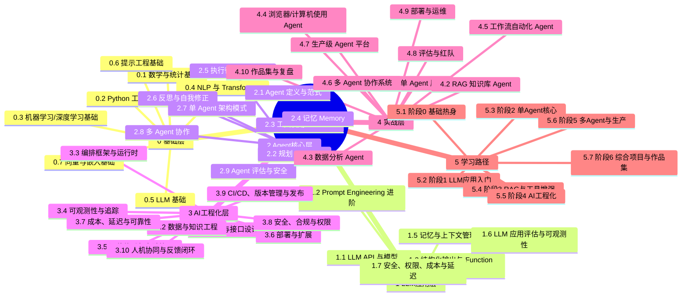

## 0. 文本大纲：AI Agent 与 AI 工程化知识地图

### 0 基础层
- 0.1 数学与统计基础
- 0.2 Python 工程基础
- 0.3 机器学习/深度学习基础
- 0.4 NLP 与 Transformer
- 0.5 LLM 基础
- 0.6 提示工程基础
- 0.7 向量与嵌入基础

### 1 LLM 应用层
- 1.1 LLM API 与模型选型
- 1.2 Prompt Engineering 进阶
- 1.3 结构化输出与 Function Calling
- 1.4 RAG
- 1.5 记忆与上下文管理
- 1.6 LLM 应用评估与可观测性
- 1.7 安全、权限、成本与延迟

### 2 Agent 核心层
- 2.1 Agent 定义与范式
- 2.2 规划 Planning
- 2.3 工具使用 Tool Use
- 2.4 记忆 Memory
- 2.5 执行循环与状态机
- 2.6 反思与自我修正
- 2.7 单 Agent 架构模式
- 2.8 多 Agent 协作
- 2.9 Agent 评估与安全

### 3 AI 工程化层
- 3.1 架构与接口设计
- 3.2 数据与知识工程
- 3.3 编排框架与运行时*
- 3.4 可观测性与追踪
- 3.5 评估体系与实验管理
- 3.6 部署与扩展
- 3.7 成本、延迟与可靠性
- 3.8 安全、合规与权限
- 3.9 CI/CD、版本管理与发布
- 3.10 人机协同与反馈闭环

### 4 实战层
- 4.1 单 Agent 原型
- 4.2 RAG 知识库 Agent
- 4.3 数据分析 Agent
- 4.4 浏览器/计算机使用 Agent*
- 4.5 工作流自动化 Agent
- 4.6 多 Agent 协作系统
- 4.7 生产级 Agent 平台
- 4.8 评估与红队
- 4.9 部署与运维
- 4.10 作品集与复盘

### 5 学习路径
- 5.1 阶段 0：基础热身
- 5.2 阶段 1：LLM 应用入门
- 5.3 阶段 2：单 Agent 核心
- 5.4 阶段 3：RAG 与工具增强
- 5.5 阶段 4：AI 工程化
- 5.6 阶段 5：多 Agent 与生产
- 5.7 阶段 6：综合项目与作品集

---

## 1. Mermaid 思维导图

---

## 2. 知识点卡片：说明 / 关键问题 / 掌握程度 / 前置依赖

掌握程度简写：  
**了解**：知道是什么；**理解**：能解释原理；**会用**：能照着做；**熟练**：能独立设计调试；**精通**：能做生产优化与权衡。

### 0 基础层

| 编号 | 知识点 | 一句话说明 | 关键问题 | 建议掌握 | 前置依赖 |
|---|---|---|---|---|---|
| 0 | 基础层 | 建立数学、编程、模型与文本表示的基本心智模型。 | 我是否理解 LLM 的输入输出与限制？ | 理解 | 无 |
| 0.1 | 数学与统计基础 | 线性代数、概率、微积分、统计是理解模型与评估的基础。 | 向量、矩阵、概率、损失函数分别解决什么？ | 了解-理解 | 无 |
| 0.2 | Python 工程基础 | Python、包管理、API、异步、测试、Git 是工程落地底座。 | 我能否写出可维护、可测试的脚本和服务？ | 会用 | 无 |
| 0.3 | 机器学习/深度学习基础 | 监督学习、神经网络、训练/验证、过拟合帮助理解模型行为。 | 模型如何学习、泛化、失败？ | 了解-理解 | 0.1, 0.2 |
| 0.4 | NLP 与 Transformer | 分词、嵌入、注意力、Transformer 是 LLM 的结构基础。 | LLM 为什么能处理长上下文？ | 理解 | 0.1-0.3 |
| 0.5 | LLM 基础 | 预训练、SFT、RLHF/DPO、推理、token、上下文、采样决定能力边界。 | 能力、幻觉、上下文窗口从哪来？ | 理解 | 0.4 |
| 0.6 | 提示工程基础 | 指令、上下文、示例、格式约束是最基本的控制手段。 | 如何稳定引导模型输出？ | 会用 | 0.5 |
| 0.7 | 向量与嵌入基础 | 嵌入、相似度、向量库、语义检索是 RAG 与记忆的基础。 | 如何把文本变成可检索向量？ | 会用 | 0.3-0.5 |

### 1 LLM 应用层

| 编号 | 知识点 | 一句话说明 | 关键问题 | 建议掌握 | 前置依赖 |
|---|---|---|---|---|---|
| 1 | LLM 应用层 | 把 LLM 作为组件，构建可调用、可约束、可评估的应用。 | 如何可靠地调用、约束、检索、观测？ | 会用-熟练 | 0 |
| 1.1 | LLM API 与模型选型 | 理解 API、模型能力、成本、延迟、上下文和部署方式。 | 什么任务该选什么模型？ | 会用 | 0.5, 0.2 |
| 1.2 | Prompt Engineering 进阶 | 模板、少样本、CoT、自洽、提示注入防护提升稳定性。 | 如何减少随机性与注入风险？ | 会用 | 0.6, 1.1 |
| 1.3 | 结构化输出与 Function Calling | JSON Schema、工具调用、校验、重试让 LLM 驱动外部函数。 | 如何让 LLM 安全调用工具？ | 会用 | 1.1, 1.2 |
| 1.4 | RAG | 文档切分、嵌入、检索、重排、生成、引用让回答基于私有知识。 | 如何提升检索质量与答案可信度？ | 熟练 | 0.7, 1.1-1.3 |
| 1.5 | 记忆与上下文管理 | 短期/长期记忆、摘要、压缩、检索式记忆管理多轮状态。 | 多轮中该记住什么、忘掉什么？ | 会用 | 1.4 |
| 1.6 | LLM 应用评估与可观测性 | 离线/在线评估、指标、日志、追踪判断系统是否变好。 | 如何量化效果与定位问题？ | 理解-会用 | 1.1-1.5 |
| 1.7 | 安全、权限、成本与延迟 | 注入、越权、PII、预算、缓存、限流决定生产可用性。 | 如何控制风险、成本与延迟？ | 理解-会用 | 1.1-1.6 |

### 2 Agent 核心层

| 编号 | 知识点 | 一句话说明 | 关键问题 | 建议掌握 | 前置依赖 |
|---|---|---|---|---|---|
| 2 | Agent 核心层 | 让 LLM 在循环中感知、规划、行动、反思，完成多步任务。 | 如何自主完成复杂目标且不失控？ | 熟练 | 1 |
| 2.1 | Agent 定义与范式 | Agent = LLM + 工具 + 记忆 + 循环 + 目标。 | Agent 与固定工作流的边界在哪？ | 理解 | 1.3, 1.5 |
| 2.2 | 规划 Planning | 任务分解、计划、重规划、路由决定行动顺序。 | 如何把模糊目标拆成可执行步骤？ | 熟练 | 2.1 |
| 2.3 | 工具使用 Tool Use | 工具定义、调用、参数校验、错误处理、权限是行动能力。 | 如何安全、可靠地调用外部系统？ | 熟练 | 1.3, 2.1 |
| 2.4 | 记忆 Memory | 工作记忆、情节记忆、语义记忆、摘要/检索支撑长期任务。 | 状态如何持久化、检索与更新？ | 熟练 | 1.5, 2.1 |
| 2.5 | 执行循环与状态机 | ReAct、Plan-Execute、图/状态机、中断恢复控制流程。 | 如何防止死循环、跑偏、不可恢复？ | 熟练 | 2.1-2.4 |
| 2.6 | 反思与自我修正 | 反思、批评、重试、验证器让 Agent 从错误中恢复。 | 如何判断错了并修正？ | 理解-会用 | 2.5 |
| 2.7 | 单 Agent 架构模式 | 工具型、RAG 型、工作流型、自主型对应不同场景。 | 何时用简单工作流，何时用自主 Agent？ | 熟练 | 2.1-2.6 |
| 2.8 | 多 Agent 协作 | 角色分工、通信、辩论、监督、群体协作解决复杂任务。 | 多 Agent 何时真的优于单 Agent？ | 理解-会用 | 2.7 |
| 2.9 | Agent 评估与安全 | 任务成功率、轨迹、成本、红队、权限证明 Agent 可靠。 | 如何证明 Agent 可信、可控、可审计？ | 熟练 | 1.6, 2.5 |

### 3 AI 工程化层

| 编号 | 知识点 | 一句话说明 | 关键问题 | 建议掌握 | 前置依赖 |
|---|---|---|---|---|---|
| 3 | AI 工程化层 | 把原型变成可运维、可评估、可扩展、可合规的系统。 | 如何从 Demo 走向生产？ | 熟练 | 2 |
| 3.1 | 架构与接口设计 | 服务边界、API、事件、同步异步、人机协同决定系统解耦。 | 系统如何分层、解耦、扩展？ | 熟练 | 2.7 |
| 3.2 | 数据与知识工程 | 数据采集、清洗、切分、标注、版本、权限决定知识质量。 | 知识如何持续更新且可追溯？ | 熟练 | 1.4 |
| 3.3 | 编排框架与运行时* | LangGraph、LlamaIndex、OpenAI Agents SDK、MCP 等负责编排。 | 框架选型与抽象如何避免锁定？ | 会用 | 2.5, 3.1 |
| 3.4 | 可观测性与追踪 | 日志、trace、span、token、工具调用、回放帮助定位问题。 | 出错时如何还原完整轨迹？ | 熟练 | 1.6, 3.1 |
| 3.5 | 评估体系与实验管理 | 数据集、指标、A/B、回归、LLM-as-judge 支撑持续迭代。 | 如何知道改版是变好还是变坏？ | 熟练 | 1.6, 3.4 |
| 3.6 | 部署与扩展 | 容器、Serverless、队列、缓存、并发、伸缩支撑上线。 | 如何稳定承载真实流量？ | 熟练 | 3.1 |
| 3.7 | 成本、延迟与可靠性 | 预算、缓存、路由、降级、重试、幂等控制 SLA。 | 如何平衡效果、成本、延迟？ | 熟练 | 3.6 |
| 3.8 | 安全、合规与权限 | 认证、授权、审计、PII、内容安全、合规防止泄露与越权。 | 如何做到最小权限与可审计？ | 熟练 | 1.7, 3.1 |
| 3.9 | CI/CD、版本管理与发布 | Prompt/模型/工具/数据版本、测试、灰度、回滚管理变更。 | 如何安全发布与回滚？ | 熟练 | 3.5, 3.6 |
| 3.10 | 人机协同与反馈闭环 | 审批、标注、反馈、持续学习让系统越用越好。 | 人在哪些节点介入最有效？ | 理解-会用 | 3.4, 3.5 |

### 4 实战层

| 编号 | 知识点 | 一句话说明 | 关键问题 | 建议掌握 | 前置依赖 |
|---|---|---|---|---|---|
| 4 | 实战层 | 用项目串联知识，形成可展示、可复盘、可上线能力。 | 我能否独立交付一个 Agent？ | 熟练 | 3 |
| 4.1 | 单 Agent 原型 | 命令行/网页助手，调用工具完成闭环任务。 | 最小可用 Agent 是什么样？ | 会用 | 1, 2.1-2.3 |
| 4.2 | RAG 知识库 Agent | 私有文档问答 + 引用 + 评估。 | 检索和生成如何联合评估？ | 熟练 | 1.4, 2.4 |
| 4.3 | 数据分析 Agent | SQL/Python/图表，沙箱执行与结果解释。 | 如何安全执行代码与查询？ | 熟练 | 2.3, 3.8 |
| 4.4 | 浏览器/计算机使用 Agent* | 网页操作、截图、DOM、GUI 自动化。 | 如何提升稳定性与可恢复性？ | 了解-会用 | 2.3, 3.7 |
| 4.5 | 工作流自动化 Agent | 邮件、日历、CRM、审批等企业流程集成。 | 权限、幂等、审计怎么做？ | 熟练 | 2.7, 3.1 |
| 4.6 | 多 Agent 协作系统 | 研究、写作、评审、辩论等角色协作。 | 通信成本是否值得？ | 理解-会用 | 2.8 |
| 4.7 | 生产级 Agent 平台 | 多租户、工具市场、监控、计费、权限平台化。 | 如何平台化复用与治理？ | 熟练 | 3 |
| 4.8 | 评估与红队 | 构建评估集、对抗测试、报告与修复。 | 如何证明安全与可靠？ | 熟练 | 2.9, 3.5 |
| 4.9 | 部署与运维 | CI/CD、监控、告警、SLA、故障演练。 | 如何保证线上稳定？ | 熟练 | 3.6-3.9 |
| 4.10 | 作品集与复盘 | 文档、架构图、指标、演示、复盘形成能力证明。 | 如何让别人相信我能做？ | 熟练 | 4.1-4.9 |

### 5 学习路径

| 编号 | 阶段 | 目标 | 项目 | 里程碑 |
|---|---|---|---|---|
| 5.1 | 阶段 0：基础热身 | 理解 Python、Transformer、LLM、提示基础。 | 调用 LLM API 的问答 CLI。 | 能解释 token、上下文、温度、幻觉；能发请求并处理返回。 |
| 5.2 | 阶段 1：LLM 应用入门 | 稳定调用、结构化输出、基础评估。 | 信息抽取器 / JSON 输出助手。 | 有校验、重试、日志；能比较两个 Prompt。 |
| 5.3 | 阶段 2：单 Agent 核心 | 掌握工具调用、规划、记忆、状态机。 | 工具型研究助手。 | 能多步执行、调用工具、记录轨迹、处理失败。 |
| 5.4 | 阶段 3：RAG 与工具增强 | 私有知识 + 记忆 + 检索评估。 | 知识库问答 Agent。 | 有引用、检索指标、坏例分析、权限过滤。 |
| 5.5 | 阶段 4：AI 工程化 | 可观测、评估、部署、CI/CD、成本控制。 | 部署一个带监控与评估的 Agent API。 | 有 trace、评估集、灰度、回滚、预算告警。 |
| 5.6 | 阶段 5：多 Agent 与生产 | 多 Agent 协作与平台化。 | 多 Agent 内容/研究团队。 | 角色清晰、通信可控、评估证明优于单 Agent。 |
| 5.7 | 阶段 6：综合项目与作品集 | 端到端独立交付。 | 自选生产级 Agent 项目。 | 架构图、指标、演示、复盘、可复现文档。 |

